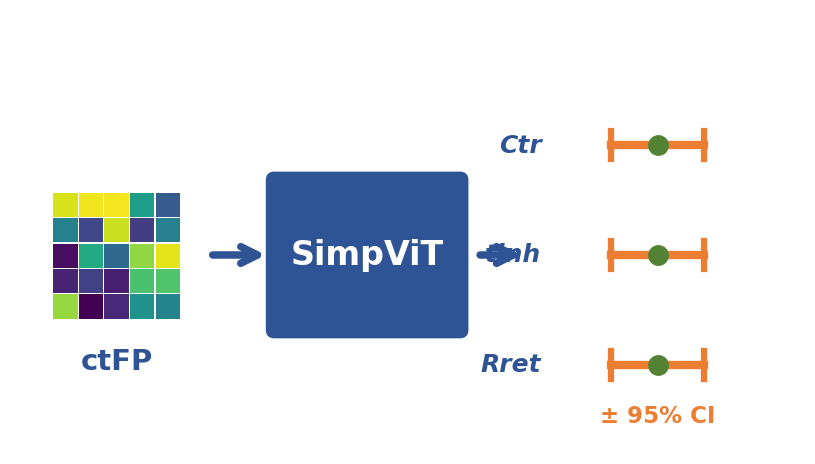

# ViT-Ctr: Vision Transformer for RAFT Polymerization Parameter Extraction

Simultaneous extraction of chain transfer constant (C_tr), inhibition period, and retardation factor from conversion–time fingerprint (ctFP) images using a simplified Vision Transformer (SimpViT).



## Highlights

- A comprehensive RAFT kinetic ODE model covering four agent classes: dithioesters, trithiocarbonates, dithiocarbamates, and xanthates
- A novel conversion–time fingerprint (ctFP) encoding that converts kinetic curves into 2-channel images
- A lightweight SimpViT model (877K parameters) that simultaneously predicts three kinetic parameters
- Validation against 77 literature-reported C_tr values (R² = 0.97) and comparison with the classical Mayo method

## Project Structure

```
ViT-Ctr/
├── src/                    # Core source code
│   ├── raft_ode.py         # RAFT kinetic ODE model (4 agent classes)
│   ├── ctfp_encoder.py     # Conversion-time fingerprint encoder
│   ├── model.py            # SimpViT architecture
│   ├── dataset_generator.py# Synthetic dataset generation
│   ├── dataset.py          # HDF5 dataset loader
│   ├── train.py            # Training pipeline
│   ├── evaluate.py         # Evaluation & metrics
│   ├── literature_validation.py  # Literature validation
│   ├── app_utils.py        # Streamlit app utilities
│   └── utils/              # Metrics, visualization, data splitting
├── app.py                  # Streamlit web application
├── scripts/                # Utility scripts
│   ├── generate_figures.py # Generate all paper figures
│   ├── generate_docx.py    # Generate Word manuscripts (EN/CN)
│   ├── validate_dataset.py # Dataset validation
│   └── upload_to_gdrive.py # Google Drive upload helper
├── paper/                  # Manuscript files
│   ├── manuscript.tex      # LaTeX manuscript
│   ├── manuscript_en.docx  # English Word version
│   ├── manuscript_cn.docx  # Chinese Word version
│   ├── supporting_information.tex
│   └── references.bib
├── figures/                # All figures for the paper
├── notebooks/              # Jupyter notebooks for exploration
├── colab/                  # Google Colab training notebooks
├── tests/                  # Unit tests
├── data/                   # Data directory (large files not in repo)
│   └── literature/         # Literature C_tr values
├── requirements.txt
└── pyproject.toml
```

## Quick Start

### Installation

```bash
pip install -r requirements.txt
```

### Generate Synthetic Dataset

```bash
python -c "from src.dataset_generator import generate_all; generate_all('data/')"
```

### Train the Model

```bash
python -m src.train --data-dir data/ --epochs 100 --batch-size 64
```

Or use the Colab notebook: `colab/03-train-colab.ipynb`

### Run the Web App

```bash
streamlit run app.py
```

### Run Tests

```bash
pytest tests/ -v
```

## Method Overview

1. **ODE Model**: A unified RAFT polymerization kinetic model solves coupled ODEs for monomer, CTA, and radical concentrations across four RAFT agent classes with class-specific fragmentation and side-reaction pathways.

2. **ctFP Encoding**: Conversion–time curves are encoded as 2-channel 64×64 images — channel 0 stores the normalized conversion profile, channel 1 encodes the CTA/monomer ratio evolution.

3. **SimpViT**: A simplified Vision Transformer with 4×4 patches, 6 transformer blocks, and 3-head regression output simultaneously predicts log₁₀(C_tr), inhibition period, and retardation factor.

4. **Validation**: The model is validated against 77 literature C_tr values spanning 4 orders of magnitude, achieving R² = 0.97 and outperforming the classical Mayo method.

## Key Results

| Metric | log₁₀(C_tr) | Inhibition Period | Retardation Factor |
|--------|-------------|-------------------|-------------------|
| R² (test set) | 0.998 | 0.995 | 0.993 |
| R² (literature) | 0.97 | — | — |

## Citation

If you use this code, please cite:

```bibtex
@article{vit-ctr-2025,
  title={Simultaneous Extraction of Chain Transfer Constant, Inhibition Period,
         and Retardation Factor from RAFT Polymerization Data via Vision Transformer},
  author={...},
  journal={...},
  year={2025}
}
```

## License

This project is for academic research purposes.
